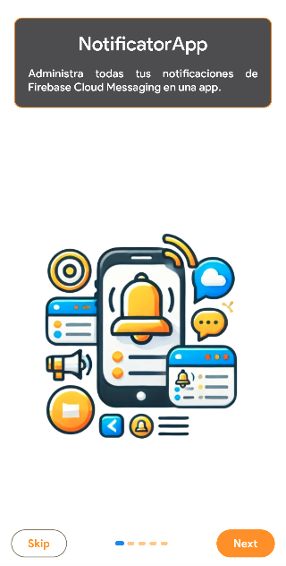

<p align="center">
  <a href="https://rlujancreations.es/" target="blank"></a>
</p>

> [!NOTE]
> 🇪🇸 This README is also available in [Spanish](README.md).

---

# Kotlin Multiplatform Mobile Template Project

> ⚠️ **This project is under active development.**  
> Some features may still be in progress or subject to change.


## Description

**NotificatorApp** is a multiplatform application built with Kotlin Multiplatform (KMP), offering a
modern and intuitive interface to manage the sending of notifications via Google Cloud Messaging.
Thanks to its architecture, the app is available for Android, iOS, and Desktop, enabling usage
across a wide range of devices and scenarios.

This project was developed based on the [KMMTemplateMM](https://github.com/kmorfo/KMMTemplateMM),
extending its compatibility to different platforms while maintaining a consistent user experience.
The application serves as the frontend for the backend service provided by
the [Notificator app](https://github.com/kmorfo/Notificator), which is open-source and available on
GitHub as well as a Docker image at `kmorfo/notificator_app`.

## 🖼 Proyect screens

<h4 align="center">🧭 Onboarding screen</h4>

| **Expanded** | **Medium** | **Compact** |
|:------------:|:----------:|:-----------:|
|  |  |  |

<h4 align="center">🗝️ Login screen</h4>

| **Expanded** | **Medium** | **Compact** |
|:------------:|:----------:|:-----------:|
|  |  |  |


---

### Key Features

- **Multiplatform:** Designed for Android, iOS, and Desktop, leveraging Kotlin Multiplatform to
  share business logic between platforms, reducing maintenance effort and speeding up development.
- **Modularized structure:** Organized into layers to ensure clear separation of concerns and
  improve scalability.
- **Convention Plugins:** Uses a centralized and declarative approach for Gradle configuration.
- **Offline-first Mode:** The app is designed to function without an internet connection and syncs
  data when online.
- **Dark/Light Theme:** Supports both light and dark modes, adapting to user preferences and
  enhancing the visual experience.
- **Open Source Backend:** Backed by the Notificator app, ensuring flexibility and transparency with
  a community-driven codebase.
- **Libraries used:**
  - `ktlint` for code formatting.
  - `Room` for local database management.
  - `Ktor` for handling HTTP requests.
  - `Koin` for dependency injection.
  - `Compose Navigation` for declarative UI navigation.
  - `Moko Permissions` for cross-platform permission handling.
  - `JUnit` for unit testing.
  - `Napier` for Kotlin Multiplatform logging.

### Included Modules

1. **composeApp**: Common module and main entry point of the app.
2. **core**: Divided into submodules:
   - `data`: Data access layer and repositories.
   - `database`: Database configuration and management.
   - `domain`: Business logic and use cases.
   - `presentation`: Shared presentation logic.
3. **build-logic**: Convention plugins for centralized Gradle configuration.
4. **commonTest**: Shared module for writing unit tests.
5. **gradle**: Gradle configuration files.
6. **onboarding**: Onboarding flow for new users.
7. **auth**: Authentication, registration, and password recovery.
8. **home**: Main application module.

## Benefits of Convention Plugins

Convention plugins help centralize and simplify Gradle project configuration, improving consistency
and reducing redundancy. Key benefits include:

- **Consistency:** Ensures all common configurations (e.g., dependency versions, build settings) are
  defined in one place.
- **Scalability:** Makes it easier to add new modules without duplicating configuration.
- **Maintainability:** Changes in configuration need to be made only once, reducing errors and
  maintenance effort.

## Benefits of a Modular Architecture

Modularization is essential for building scalable and maintainable software. This project is
organized into well-defined modules, offering these benefits:

1. **Separation of concerns:** Each module has a clearly defined responsibility, making development
   and understanding easier.
2. **Code reuse:** Shared modules can be reused across platforms and projects.
3. **Simplified testing:** Tests can be run in isolation on specific modules.
4. **Scalability:** Enables large teams to work on different modules independently.

## Requirements

- Kotlin Multiplatform set up in your development environment.
- Android Studio (preferably the latest stable version).
- Xcode for iOS development.
- The Notificator backend running. You can either clone
  the [Notificator repository](https://github.com/kmorfo/Notificator) or run it as a Docker
  container.

## Setup

1. Clone the Notificator app or run it as a Docker container:

   ```bash
    git clone https://github.com/kmorfo/notificatorapp

   ```

2. Sync the project with Gradle to download dependencies.

3. Configure the target platforms (Android and iOS) as needed.

## Project Structure

```
project-root/
├── composeApp/        # App entry point
├── core/              # Core layer with shared logic and libraries
│   ├── data/          # Data repositories and access
│   ├── database/      # Room configuration
│   ├── domain/        # Use cases and business logic
│   └── presentation/  # Shared presentation logic
├── onboarding/        # Onboarding screens for first-time users
│   ├── domain/        # Business logic and use cases
│   └── presentation/  # Presentation logic
├── auth/              # Authentication, sign-up, and password recovery
│   ├── data/          # Data repositories and access
│   ├── domain/        # Use cases and business logic
│   └── presentation/  # Presentation logic
├── home/              # Main application screen
│   ├── data/          # Data repositories and access
│   ├── domain/        # Use cases and business logic
│   └── presentation/  # Presentation logic
├── build-logic/       # Convention plugins
├── commonTest/        # Shared unit tests
└── gradle/            # Gradle configurations
```

## Contribution

Contributions are welcome! Please feel free to open an issue or submit a pull request with
improvements.

## License

This project is licensed under the MIT License. See the `LICENSE` file for details.
