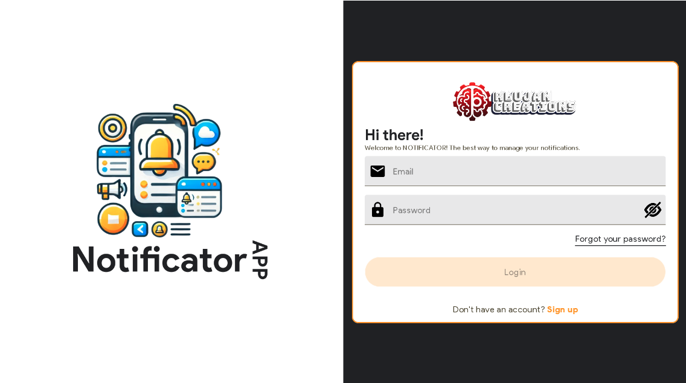
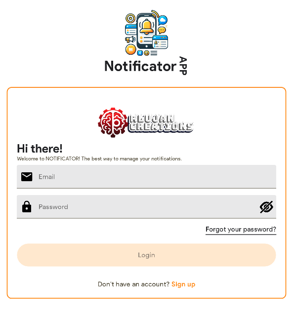

<p align="center">
  <a href="https://rlujancreations.es/" target="blank"></a>
</p>

> [!NOTE]
> 🌐 This README is also available in [English](README.en.md).

---

# Kotlin Multiplatform Mobile Template Project

> ⚠️ **Este proyecto está en desarrollo activo.**  
> Algunas funciones pueden cambiar o no estar completamente implementadas todavía.


## Descripción

NotificatorApp es una aplicación multiplataforma desarrollada con Kotlin Multiplatform Platform (
KMP)
que ofrece una interfaz intuitiva y moderna para gestionar el envío de notificaciones a través de
Google Cloud Messaging. Gracias a su arquitectura, la aplicación está disponible para Android, iOS y
Desktop, lo que permite un amplio rango de dispositivos y escenarios de uso.

Este proyecto se ha desarrollado a partir de la
plantilla [KMMTemplateMM](https://github.com/kmorfo/KMMTemplateMM), ampliando su
compatibilidad
para abarcar diferentes plataformas sin renunciar a la consistencia en la experiencia de usuario. La
aplicación actúa como frontend para el servicio de backend provisto por
la [app Notificator](https://github.com/kmorfo/Notificator), la cual
se encuentra disponible como software de código abierto en GitHub y como imagen de Docker en
kmorfo/notificator_app

## 🖼 Imágenes del proyecto.

<h4 align="center">🧭 Onboarding screen</h4>

| **Expanded** | **Medium** | **Compact** |
|:------------:|:----------:|:-----------:|
|  |  |  |

<h4 align="center">🗝️ Login screen</h4>

| **Expanded** | **Medium** | **Compact** |
|:------------:|:----------:|:-----------:|
|  |  |  |


---

### Características principales

- **Multiplataforma:** Diseñado para Android, iOS y Desktop, aprovechando las ventajas de Kotlin
  Multiplatform para compartir lógica de negocio entre plataformas, reduciendo el esfuerzo de
  mantenimiento y acelerando el tiempo de desarrollo.
- **Estructura modularizada:** Los módulos están organizados en capas para una mejor separación de
  responsabilidades y escalabilidad.
- **Plugins de convenciones (Convention Plugins):** Utiliza un enfoque declarativo y centralizado
  para la configuración de Gradle.
- **Modo Offline-first:** La aplicación está diseñada para funcionar sin conexión a internet,
  sincronizando los datos cuando la conexión esté disponible.
- **Modo oscuro/claro:** Soporte para temas claro y oscuro, adaptándose a las preferencias del
  usuario y mejorando la experiencia visual.
- **Backend Open Source:** Se apoya en la aplicación Notificator, lo que garantiza flexibilidad y
  transparencia al estar completamente abierta a la comunidad.
- **Librerías utilizadas:**
    - `ktlint` para el formateo del código.
    - `Room` para la gestión de bases de datos.
    - `Ktor` para el manejo de peticiones HTTP.
    - `Koin` para la inyección de dependencias.
    - `Compose Navigation` para la navegación en interfaces declarativas.
    - `Moko Permissions` para la gestión de permisos multiplataforma.
    - `JUnit` para pruebas unitarias.
    - `Napier` es una librería para logs en Kotlin Multiplatform.

### Módulos incluidos

1. **composeApp**: Módulo común y punto de entrada de la aplicación.
2. **core**: Dividido en submódulos:
    - `data`: Capa de acceso a datos y repositorios.
    - `database`: Configuración y gestión de la base de datos.
    - `domain`: Capa de lógica de negocio y casos de uso.
    - `presentation`: Lógica de presentación compartida.
3. **build-logic**: Plugins de convenciones para centralizar la configuración de Gradle.
4. **commonTest**: Módulo común para la escritura de pruebas unitarias compartidas.
5. **gradle**: Archivo de configuración de Gradle.
6. **onboarding**: Modulo de Onboarding de la aplicación.
7. **auth**: Modulo de autenticación de la aplicación.
8. **home**: Modulo principal de la aplicación.

## Beneficios de los Convention Plugins

Los Convention Plugins son una forma de centralizar y simplificar la configuración de los proyectos
Gradle, mejorando la consistencia y reduciendo la redundancia. Entre sus beneficios destacan:

- **Consistencia:** Garantizan que todas las configuraciones comunes (como la versión de las
  dependencias o las configuraciones de compilación) se definan en un único lugar.
- **Escalabilidad:** Facilitan la adición de nuevos módulos sin duplicar configuraciones.
- **Mantenibilidad:** Hacen que el proyecto sea más fácil de mantener, ya que los cambios en la
  configuración solo se deben realizar una vez.

## Beneficios de una Arquitectura Modular

La modularización es un enfoque clave para el desarrollo de software escalable y mantenible. Este
proyecto está organizado en módulos que ofrecen los siguientes beneficios:

1. **Separación de responsabilidades:** Cada módulo tiene un área de responsabilidad claramente
   definida, lo que facilita la comprensión y el desarrollo.
2. **Reutilización de código:** Los módulos comúnmente utilizados pueden ser compartidos entre
   diferentes plataformas y proyectos.
3. **Pruebas más simples:** Las pruebas se pueden realizar de forma aislada en módulos específicos.
4. **Escalabilidad:** Permite a equipos grandes trabajar en diferentes módulos de manera
   independiente.

## Requisitos

- Kotlin Multiplatform configurado en tu entorno de desarrollo.
- Android Studio (preferiblemente la última versión estable).
- Xcode para desarrollo en iOS.
- Tener el backend Notificator en funcionamiento. Puedes clonar el
  repositorio [Notificator](https://github.com/kmorfo/Notificator) ejecutarlo como un contenedor
  Docker.

## Configuración

1. Clona el repositorio de la app Notificator o ejecútalo como un contenedor Docker:
   ```
   git clone https://github.com/kmorfo/Notificator
   ```
2. Clona este repositorio:
   ```
   git clone https://github.com/kmorfo/notificatorapp
   ```
3. Sincroniza el proyecto con Gradle para descargar las dependencias.

## Estructura del Proyecto

```
project-root/
├── composeApp/       # Punto de entrada de la aplicación
├── core/            # Capa de core de la aplicación con funciónes y librerias comunes
│   ├── data/        # Repositorios y acceso a datos
│   ├── database/    # Configuración de Room
│   ├── domain/      # Casos de uso y lógica de negocio
│   └── presentation/ # Lógica de presentación
├── onboarding/      # Onboarding de la aplicación (primera vez)
│   ├── domain/      # Casos de uso y lógica de negocio
│   └── presentation/ # Lógica de presentación
├── auth/            # Pantallas de autenticación, registro y reestablecimiento de contraseña
│   ├── data/        # Repositorios y acceso a datos
│   ├── domain/      # Casos de uso y lógica de negocio
│   └── presentation/ # Lógica de presentación
├── home/            # Pantalla principal de la aplicación
│   ├── data/        # Repositorios y acceso a datos
│   ├── domain/      # Casos de uso y lógica de negocio
│   └── presentation/ # Lógica de presentación
├── build-logic/     # Plugins de convenciones
├── commonTest/      # Pruebas unitarias comunes
└── gradle/         # Configuraciones de Gradle
```

## Contribución

Las contribuciones son bienvenidas. Por favor, abre un issue o envía un pull request con tus
mejoras.

## Licencia

Este proyecto está bajo la licencia MIT. Consulta el archivo `LICENSE` para más detalles.
